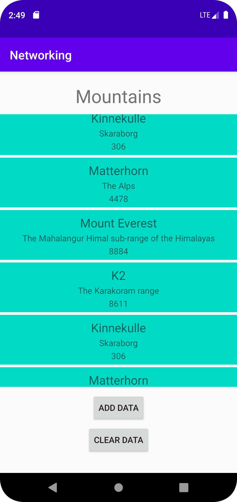
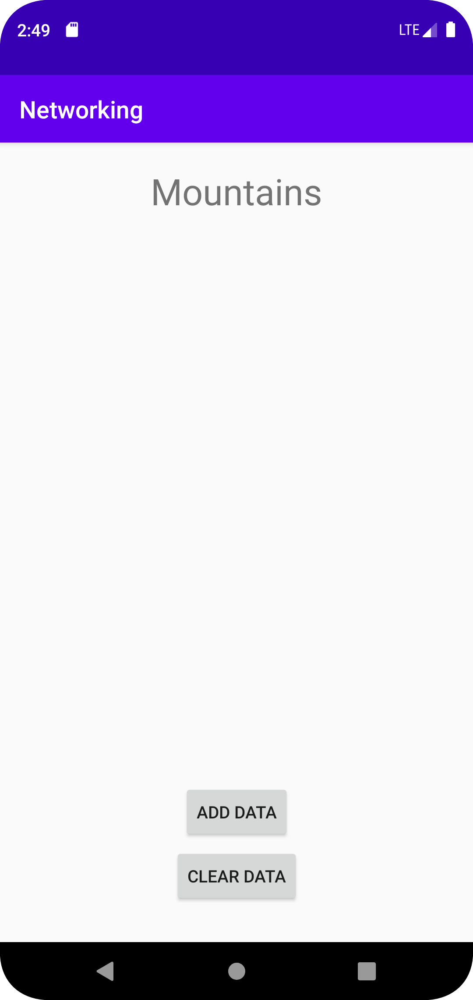

# Rapport

I denna uppgift skulle en RecyclerView skapas och sen fyllas med data från en URL. 
Det var bara en activity, vars layout höll en textview (heading), en recyclerview (för innehållet i URLen), en knapp för att lägga till data i viewen och en knapp för att ta bort den igen. 
Förutom den layouten så fanns det även en till xml-fil som höll designen för varje item i recyclerviewen. 

För att skapa recyclerviewen skapades först själva layoutobjektet i activity_main.xml, som sen kopplades samman med en variabel i MainActivity.
RecyclerView-en behövde en Adapter och en LayoutManager för att fungera. LayoutManagern fanns från början, men Adaptern behövde skapas separat.

För att få tag i innehållet av URLen skapades först en klass (Mountains.java) och sen skapades en lista av dessa i MainActivity.
I adaptern behövdes tre olika funktioner och en till lista, som kopplas ihop med listan i Main activity. 

```
private List<Mountain> mountainList;
public MyAdapter(List<Mountain> mountainList) {
    this.mountainList = mountainList;
}
```
Figur 1     Lista av berg i MyAdapter.java

En av funktionerna i adaptern behöver en ViewHolder, så då fick den skapas också.
Det behövde finnas lika många variabler i ViewHoldern som antalet variabler som skulle skrivas ut i RecyclerView Itemet.
I detta fall, name, location och size.

```
public MyViewHolder(@NonNull View itemView) {
    super(itemView);
    name = itemView.findViewById(R.id.item_name);
    location = itemView.findViewById(R.id.item_location);
    size = itemView.findViewById(R.id.item_size);
}
```
Figur 2     Koden i MyViewHolder.java

Koden för att lägga till data i listan som skapades i MainActivity kördes i en funktion som kallades med en knapp.
I den funktionen skapades en temporär lista av berg som fylldes med datan från URLen.
Sen fördes datan från den temporära listan över till den riktiga listan, som i sin tur uppdaterades så att även informationen i recyclerviewen uppdaterades. 

```
public void onPostExecute(String json) {
    Log.d("MainActivity", json);

    Gson gson = new Gson();
    Type type = new TypeToken<List<Mountain>>() {}.getType();
    List<Mountain> tempList = gson.fromJson(json, type);
    if(tempList != null) {
        Log.d(TAG, "Number of elements: " + tempList.size());
        Log.d(TAG, "Element 0: " + tempList.get(0).toString());
        listOfMountains.addAll(tempList);
        adapter.notifyDataSetChanged();
    }
    else {
        Log.d(TAG, "There were no elements to show.");
    }
}
```
Figur 3     Koden som fyller listan med information från en URL.

Eftersom denna kallades med en knapp så kunde datan läggas till flera gånger om. 
Därför skapades även en "clear"-knapp för att tömma listan och i sin tur recyclerviewen.


Figur 4     Recyclerviewen fylld med data.


Figur 5     Den tomma recyclerviewen. 